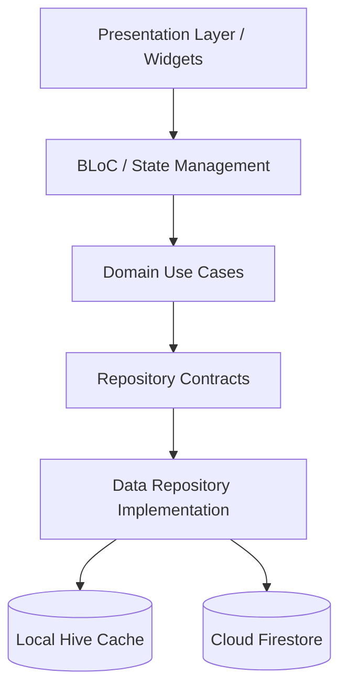

# PhysioOne - Technical Documentation

Welcome to the technical documentation for **PhysioOne** (also referred to as *Clinic Management System* or *Physio Prime*), a multiplatform Flutter application designed for managing physical therapy clinics, client packages, doctor schedules, financial records, and employee HR workflows (including GPS-bounded attendance check-ins).

---

## 📌 Project Overview

**PhysioOne** provides a comprehensive clinic management portal designed primarily for desktop/web clinic operations and staff management.

### Key Capabilities
- 📅 **Interactive Schedule Grid**: Real-time matrix view of doctor availability, daily time slots, client appointments, and booking status.
- 👥 **Client & Package Management**: Auto-incrementing client registration, medical notes, and session tracking across service packages (Physio, Machines, Rehabilitation).
- 🩺 **Doctor Management**: Maintenance of doctor profiles, specialties, and weekly working days.
- 🔒 **Role-Based Authentication & Access**: Multi-role support (`admin`, `desk`, employee positions) controlling navigation and features.
- ⏱️ **HR & Geofenced Attendance System**: Employee records, salary structures, leave/allowance requests, and GPS-bounded check-in (validates position within 200m radius of clinic coordinates `lat: 30.049003, lng: 31.240011`).
- 💰 **Financial Management**: Daily and monthly income/expense tracking, session revenue, and financial summary cards.
- 🔔 **Billing & System Services**: Reminders, bill notifications, and system service request module.

---

## 🛠️ Technology Stack

| Layer | Technology |
|---|---|
| **Framework** | [Flutter](https://flutter.dev) (SDK `^3.7.2`), Dart |
| **Target Platforms** | Web, Android, iOS, Windows, macOS, Linux |
| **State Management** | BLoC / Cubit (`flutter_bloc` `^9.1.1`, `bloc` `^9.0.0`, `rxdart` `^0.28.0`) |
| **Remote Database** | Cloud Firestore (`cloud_firestore` `^5.6.9`) |
| **Backend Services** | Firebase Core (`firebase_core` `^3.14.0`), Firebase Auth (`firebase_auth` `^5.6.0`) |
| **Local Cache** | Hive (`hive_flutter` `^1.1.0`) with custom adapters |
| **Geolocation** | `geolocator` (`^11.0.0`), `geocoding` (`^3.0.0`) |
| **Functional Helpers** | `dartz` (`^0.10.1`), `equatable` (`^2.0.7`), `intl` (`^0.20.2`), `uuid` (`^4.5.1`) |

---

## 🏛️ Architecture Snapshot

The project utilizes a **Hybrid Clean Architecture** model combined with an **Offline-First Dual-Source Repository Strategy**:



For complete details, see [Architecture Documentation](file:///g:/Work/Project/PhysioOne/clinic_web-1/docs/architecture.md).

---

## 📂 Documentation Directory Index

Explore detailed documentation for each subsystem:

1. 🏛️ **[Architecture Overview](file:///g:/Work/Project/PhysioOne/clinic_web-1/docs/architecture.md)** — Architectural patterns, clean layers, dependency flow.
2. 📁 **[Project Structure](file:///g:/Work/Project/PhysioOne/clinic_web-1/docs/project-structure.md)** — Directory layout, file responsibilities, legacy code notes.
3. ⚡ **[Feature Documentation](file:///g:/Work/Project/PhysioOne/clinic_web-1/docs/features.md)** — Detailed analysis of all application features and user flows.
4. 🗺️ **[Navigation & Routing](file:///g:/Work/Project/PhysioOne/clinic_web-1/docs/navigation.md)** — Screen routing, sidebar navigation, role-based access.
5. 🔄 **[State Management](file:///g:/Work/Project/PhysioOne/clinic_web-1/docs/state-management.md)** — BLoCs, events, states, stream subscriptions.
6. 💾 **[Data Layer & Repositories](file:///g:/Work/Project/PhysioOne/clinic_web-1/docs/data-layer.md)** — Hive cache + Firestore synchronization strategy.
7. 📦 **[Models & Entities](file:///g:/Work/Project/PhysioOne/clinic_web-1/docs/models.md)** — Data structures, domain entities, JSON mapping.
8. 🔌 **[API & Database Operations](file:///g:/Work/Project/PhysioOne/clinic_web-1/docs/api.md)** — Firestore document operations and queries.
9. 🔥 **[Firebase Integration](file:///g:/Work/Project/PhysioOne/clinic_web-1/docs/firebase.md)** — Firebase config, options, collection schemas.
10. 🔑 **[Authentication & Security](file:///g:/Work/Project/PhysioOne/clinic_web-1/docs/authentication.md)** — Auth flows, session storage, security audit notes.
11. 📦 **[Local Storage (Hive)](file:///g:/Work/Project/PhysioOne/clinic_web-1/docs/local-storage.md)** — Hive initialization, boxes, adapters.
12. 🌐 **[Localization & Internationalization](file:///g:/Work/Project/PhysioOne/clinic_web-1/docs/localization.md)** — Language support and string handling.
13. 🎨 **[UI & Design System](file:///g:/Work/Project/PhysioOne/clinic_web-1/docs/ui-design-system.md)** — Color palette (`AppColors`), ThemeData, typography.
14. 🧩 **[Reusable Components](file:///g:/Work/Project/PhysioOne/clinic_web-1/docs/reusable-components.md)** — Common widgets, dialogs, cards.
15. 🚨 **[Error Handling](file:///g:/Work/Project/PhysioOne/clinic_web-1/docs/error-handling.md)** — Failure classes, exception handling, user feedback.
16. 📚 **[Dependencies Analysis](file:///g:/Work/Project/PhysioOne/clinic_web-1/docs/dependencies.md)** — Categorized package evaluation.
17. ⚙️ **[Configuration](file:///g:/Work/Project/PhysioOne/clinic_web-1/docs/configuration.md)** — App constants, geofence coordinates, environment settings.
18. 🤖 **[Android Project Config](file:///g:/Work/Project/PhysioOne/clinic_web-1/docs/android.md)** — Gradle setup, SDK versions, permissions.
19. 🍎 **[iOS Project Config](file:///g:/Work/Project/PhysioOne/clinic_web-1/docs/ios.md)** — Info.plist, location permissions, Podfile.
20. 🧪 **[Testing Strategy](file:///g:/Work/Project/PhysioOne/clinic_web-1/docs/testing.md)** — Current test coverage and recommended test suites.
21. 🚀 **[Build & Release Guide](file:///g:/Work/Project/PhysioOne/clinic_web-1/docs/build-and-release.md)** — Step-by-step compilation and deployment commands.
22. 👨‍💻 **[Developer Onboarding Guide](file:///g:/Work/Project/PhysioOne/clinic_web-1/docs/development-guide.md)** — Environment setup and development workflows.
23. 🛠️ **[Troubleshooting Guide](file:///g:/Work/Project/PhysioOne/clinic_web-1/docs/troubleshooting.md)** — Solutions for build, Hive, and runtime issues.
24. ⚠️ **[Known Issues & Technical Debt](file:///g:/Work/Project/PhysioOne/clinic_web-1/docs/known-issues.md)** — Audit findings, security risks, legacy code.
25. 📊 **[Documentation Audit Report](file:///g:/Work/Project/PhysioOne/clinic_web-1/docs/documentation-audit.md)** — Final audit metrics and prioritized action items.

---

## ⚡ Quick Start for Developers

1. **Install Prerequisites**: Flutter SDK 3.29+, Dart 3.7+, Android Studio / Xcode / VS Code.
2. **Fetch Dependencies**:
   ```bash
   flutter pub get
   ```
3. **Run Application (Web)**:
   ```bash
   flutter run -d chrome
   ```

For detailed setup, see the [Development Guide](file:///g:/Work/Project/PhysioOne/clinic_web-1/docs/development-guide.md).
