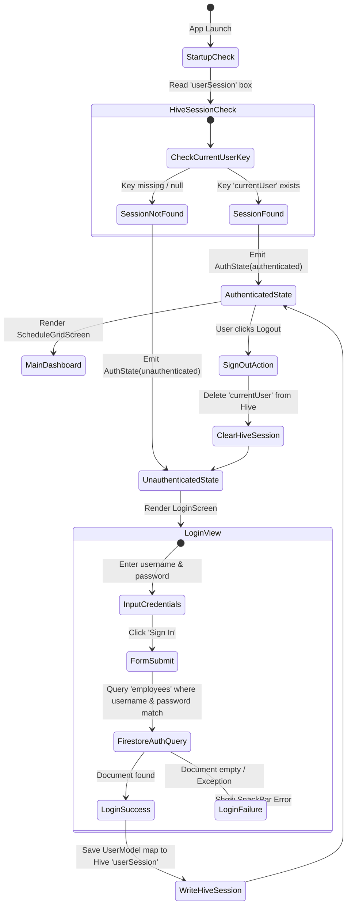

# Authentication & Security Documentation

This document describes the complete authentication lifecycle, session persistence, role permissions, and security findings in **PhysioOne**.

---

## 🔑 Authentication Architecture Lifecycle



---

## 🔒 Session Storage Mechanics

1. **Local Box**: `userSession`
2. **Session Key**: `currentUser`
3. **Storage Method**: `UserModel.toMap()` map serialized directly into Hive binary storage (`lib/ui/LoginPage/repository/auth_repository.dart:101`).
4. **Startup Check**: Invoked during `AuthBloc` initialization (`AuthStartupCheckRequested` event) via `AuthRepository.initializeAppData()`.

---

## ⚠️ Security Audit & Risk Analysis

> [!CAUTION]
> **CRITICAL SECURITY RISK: Plain-Text Password Comparison**
>
> 1. **Current Implementation**: Credentials are authenticated by executing a raw Firestore query on the `employees` collection matching `username` and `password` as plain text strings (`lib/ui/LoginPage/repository/auth_repository.dart:30`):
>    ```dart
>    final querySnapshot = await _firestore
>        .collection('employees')
>        .where('username', isEqualTo: username)
>        .where('password', isEqualTo: password)
>        .limit(1)
>        .get();
>    ```
> 2. **Vulnerability**: Passwords are stored unhashed in Firestore documents (`employees`). Any user with read access to the Firestore collection can read passwords for all employees.
> 3. **Mitigation Recommendation (P0)**:
>    - Migrate authentication to official Firebase Authentication SDK (`FirebaseAuth.instance.signInWithEmailAndPassword`).
>    - If custom credentials must be maintained in Firestore, pass passwords through PBKDF2/Bcrypt hashing before storing.

---

## 🛡️ User Roles & Feature Access Control

The authenticated `UserModel.role` or `UserModel.position` dictates application functionality:

| Role String | Privileges |
|---|---|
| `admin` | Unrestricted system access: Manage Doctors, Manage Users, Financials, System Services, Bill Notifications, HR Portal, Schedule Matrix. |
| `desk` / `reception` | Clinic operations: Schedule Grid, Add Client, Client List, Service Packages, Financial Management. Cannot access System User management or Doctor management. |
| `doctor` / `employee` | Personal schedule view, User Profile, HR Attendance check-in, Leave requests. |
