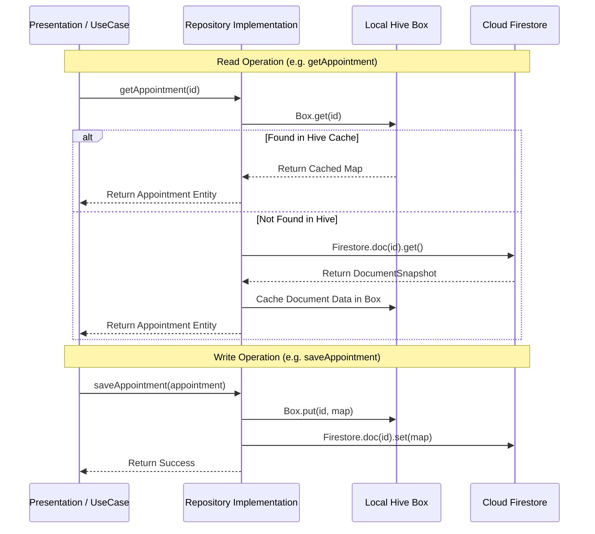

# Data Layer & Repository Documentation

This document describes the data layer architecture, repositories, data sources, and the offline-first caching strategy implemented in **PhysioOne**.

---

## 💾 Dual-Source Caching & Persistence Strategy

PhysioOne implements a **Cache-First / Dual-Source Strategy** combining local storage (**Hive**) with Cloud Database (**Cloud Firestore**).

---

## 📦 Repositories Overview

### 1. `AppointmentRepositoryImpl` (`lib/data/repositories/appointment_repository_impl.dart`)
- **Implements**: `AppointmentRepository` (`lib/domain/repositories/appointment_repository.dart`)
- **Local Storage**: Hive box `'appointments'`
- **Remote Storage**: Firestore collection `'appointments'`
- **Key Methods**:
  - `saveAppointment(Appointment appointment)`: Persists appointment map to Hive and Firestore.
  - `getAppointment(String id)`: Checks Hive first; falls back to Firestore and caches on hit.
  - `getAppointmentsForDate(DateTime date)`: Filters appointments from Hive by ISO date string (`yyyy-MM-dd`).
  - `deleteAppointment(String id)`: Removes entry from both Hive and Firestore.

---

### 2. `ClientRepositoryImpl` (`lib/data/repositories/client_repository_impl.dart`)
- **Implements**: `ClientRepository` (`lib/domain/repositories/client_repository.dart`)
- **Local Storage**: Hive box `'clients'`
- **Remote Storage**: Firestore collection `'clients'`
- **Key Methods**:
  - `saveClient(Client client)`: Saves client and updates last ID counter in `clients/metadata`.
  - `getClient(int id)`: Fetches client record by integer ID.
  - `getAllClients()`: Retrieves all non-metadata client records from Hive.
  - `getNextClientId()`: Returns `lastId + 1` from Hive metadata (or Firestore `clients/metadata` doc).
  - `updateClient(Client client)`: Updates client details and package array.

---

### 3. `DoctorRepositoryImpl` (`lib/data/repositories/doctor_repository_impl.dart`)
- **Implements**: `DoctorRepository` (`lib/domain/repositories/doctor_repository.dart`)
- **Local Storage**: Hive box `'doctors'`
- **Remote Storage**: Firestore collection `'doctors'`
- **Key Methods**:
  - `getAllDoctors()`: Prioritizes Hive; if empty, fetches snapshot from Firestore `doctors` collection and populates Hive box.
  - `getAvailableDoctorsForDate(DateTime date)`: Filters doctor list where `availableDays` contains the day of week (e.g., `'Monday'`).

---

### 4. `AuthRepository` (`lib/ui/LoginPage/repository/auth_repository.dart`)
- **Local Storage**: Hive box `'userSession'` (key: `'currentUser'`)
- **Remote Storage**: Firestore collection `'employees'`
- **Key Methods**:
  - `signIn(username, password)`: Authenticates against Firestore `employees` collection and stores session map in Hive.
  - `signOut()`: Deletes `'currentUser'` key from Hive box `'userSession'` and emits `null` on stream.
  - `initializeAppData()`: Loads session from Hive on startup and broadcasts to `currentUserStream`.

---

### 5. `EmployeeService` (`lib/hr_system/ui/employee_service.dart`)
- **Direct Remote Data Source**: Directly queries Firestore collection `'employees'` for HR operations.
- **Key Methods**: `getEmployeeById()`, `getAllEmployees()`, `employeesStream()`, `addEmployee()`, `updateEmployee()`, `deleteEmployee()`.
