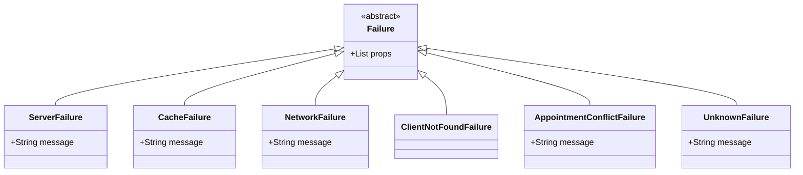

# Error Handling Documentation

This document describes the exception handling architecture, failure taxonomy, error mapping, and user feedback mechanisms in **PhysioOne**.

---

## 🚨 Failure Taxonomy (`lib/core/errors/failures.dart`)

PhysioOne utilizes functional error handling via `dartz` `Either<Failure, T>` return types for all domain use cases:

---

## 📋 Failure Classes Specification

| Failure Class | Default Message | Trigger Condition |
|---|---|---|
| `ServerFailure` | `'Server Error'` | Firestore network error or cloud database timeout |
| `CacheFailure` | `'Cache Error'` | Hive read/write exception or corrupted disk box |
| `NetworkFailure` | `'No Internet Connection'` | Disconnected device socket state |
| `ClientNotFoundFailure` | `'Client not found.'` | Attempting to assign appointment to non-existent client ID |
| `AppointmentConflictFailure` | `'Appointment conflict'` | Package session exhausted or time slot double-booked |
| `UnknownFailure` | `'Unknown Error'` | Uncaught exceptions during use case execution |

---

## 💬 Error UI Mapping & User Feedback

1. **BLoC Failure Mapping**: `ScheduleGridBloc` maps failures using `_mapFailureToMessage(Failure failure)` (`lib/ui/ScheduleGridPade/bloc/schedule_grid_bloc.dart:246`) to populate `ScheduleGridState.errorMessage`.
2. **UI Notifications**: Error feedback is presented to staff via floating `SnackBar` widgets with red backgrounds (`Colors.red`) or modal alert dialogs.
3. **Hive Box Recovery**: `initializeHive()` catches corrupted disk boxes during app boot and deletes/recreates the local box automatically (`lib/helper/initialize_hive.dart:76`).
