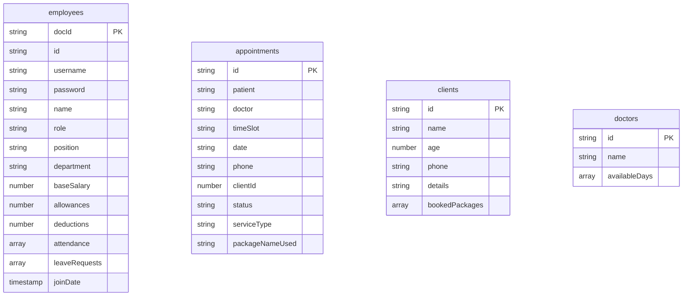

# Firebase Integration Documentation

This document describes the Firebase infrastructure, platform configurations, Firestore database schema, security considerations, and index specifications for **PhysioOne**.

---

## 🔥 Firebase Services Breakdown

| Firebase Service | Status | Usage in Codebase |
|---|---|---|
| **Firebase Core** | ✅ Active | Initialized in `lib/main.dart:18` using `DefaultFirebaseOptions.currentPlatform` |
| **Cloud Firestore** | ✅ Active | Primary cloud NoSQL database for appointments, clients, doctors, employees, services |
| **Firebase Auth** | ⚠️ Package Listed | Dependency `firebase_auth: ^5.6.0` in `pubspec.yaml`, but custom Firestore password lookup is used instead |
| **Cloud Storage** | ❌ Not Used | UNKNOWN — not determinable from codebase |
| **Cloud Messaging (FCM)**| ❌ Not Used | UNKNOWN — not determinable from codebase |
| **Crashlytics / Analytics**| ❌ Not Used | UNKNOWN — not determinable from codebase |

---

## ⚙️ Environment Configuration (`firebase.json`)

The application is linked to Firebase project **`physioone-74446`** via `firebase.json` and `lib/firebase_options.dart`:

```json
{
  "flutter": {
    "platforms": {
      "dart": {
        "lib/firebase_options.dart": {
          "projectId": "physioone-74446",
          "configurations": {
            "android": "1:419143087841:android:6b9e5d627b23913bab29a0",
            "ios": "1:419143087841:ios:d09050b56d04dc0dab29a0",
            "macos": "1:419143087841:ios:d09050b56d04dc0dab29a0",
            "web": "1:419143087841:web:2bca69c292221616ab29a0",
            "windows": "1:419143087841:web:7ab9cc2c00b8e1d4ab29a0"
          }
        }
      }
    }
  }
}
```

---

## 📊 Firestore Database Collections Schema



---

## 🔒 Recommended Firestore Security Rules Architecture

Since authentication relies on custom document fields in `employees`, standard Firebase `request.auth` rules must be configured carefully:

```javascript
rules_version = '2';
service cloud.firestore {
  match /databases/{database}/documents {
    // Allow read/write access to employees collection for authenticated session users
    match /employees/{employeeId} {
      allow read, write: if true; // RECOMMENDATION: Replace with proper Auth rules
    }
    
    match /appointments/{appointmentId} {
      allow read, write: if true;
    }
    
    match /clients/{clientId} {
      allow read, write: if true;
    }
    
    match /doctors/{doctorId} {
      allow read: if true;
      allow write: if true; // Restrict to admin role in production
    }
  }
}
```

> [!WARNING]
> Security rules requiring `request.auth != null` will currently fail because user authentication is handled via manual Firestore collection queries rather than Firebase Auth tokens. See [Authentication Documentation](file:///g:/Work/Project/PhysioOne/clinic_web-1/docs/authentication.md).
