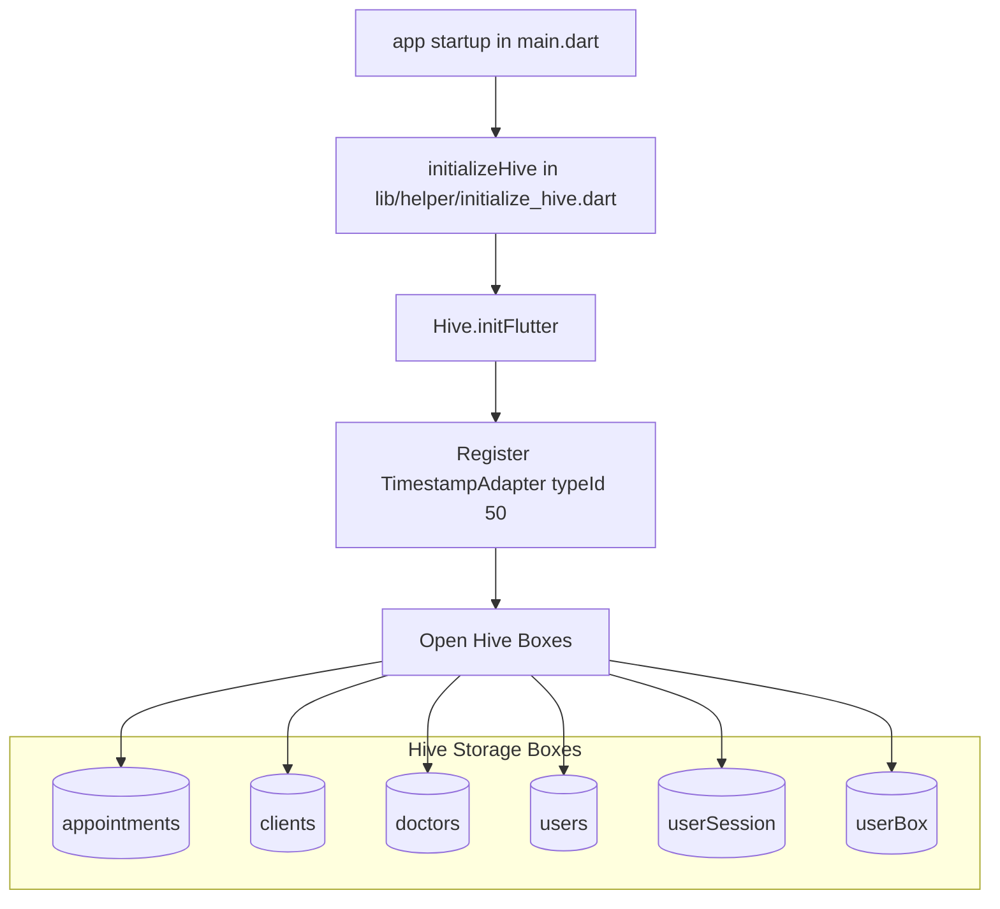

# Local Storage (Hive) Documentation

This document describes the local offline database architecture, Hive box setup, custom binary adapters, and local storage helper methods in **PhysioOne**.

---

## 📦 Hive Storage Infrastructure

PhysioOne uses **Hive** (`hive_flutter: ^1.1.0`) as its high-performance, lightweight key-value offline storage engine.



---

## 🗄️ Hive Boxes Specification

| Box Name | Data Stored | Primary Keys | Usage Location |
|---|---|---|---|
| `'appointments'` | Map representations of `AppointmentModel` | Appointment ID (`yyyy-MM-dd_Slot_Doctor`) | `AppointmentRepositoryImpl` |
| `'clients'` | Map representations of `ClientModel` & `lastId` metadata | Client ID integer string (`"1"`, `"2"`, `'lastId'`) | `ClientRepositoryImpl` |
| `'doctors'` | Map representations of `DoctorModel` | Doctor ID string | `DoctorRepositoryImpl` |
| `'users'` | System user account maps | User ID string | `ManageUsersBloc` |
| `'userSession'` | Logged-in staff `UserModel` map | `'currentUser'` | `AuthRepository` |
| `'userBox'` | Logged-in user ID string | `'loggedInUserId'` | `initializeLocalStorage()` helper |

---

## 🔌 Custom Hive Adapters (`lib/utils/hive_adapters.dart`)

### `TimestampAdapter` (`typeId: 50`)
Allows Firestore `Timestamp` objects to be encoded and decoded directly into Hive binary buffers without loss of nanosecond precision:

```dart
class TimestampAdapter extends TypeAdapter<Timestamp> {
  @override
  final int typeId = 50;

  @override
  Timestamp read(BinaryReader reader) {
    final seconds = reader.readInt();
    final nanoseconds = reader.readInt();
    return Timestamp(seconds, nanoseconds);
  }

  @override
  void write(BinaryWriter writer, Timestamp obj) {
    writer.writeInt(obj.seconds);
    writer.writeInt(obj.nanoseconds);
  }
}
```

---

## 🛠️ Recovery & Corruption Handling

In `lib/helper/initialize_hive.dart:64`, box opening operations are wrapped inside `_openBoxSafely()`. If a Hive box file suffers corruption (e.g. abrupt app termination during write), the helper automatically catches the exception, deletes the corrupted box file from disk using `Hive.deleteBoxFromDisk(boxName)`, and recreates a fresh box.
