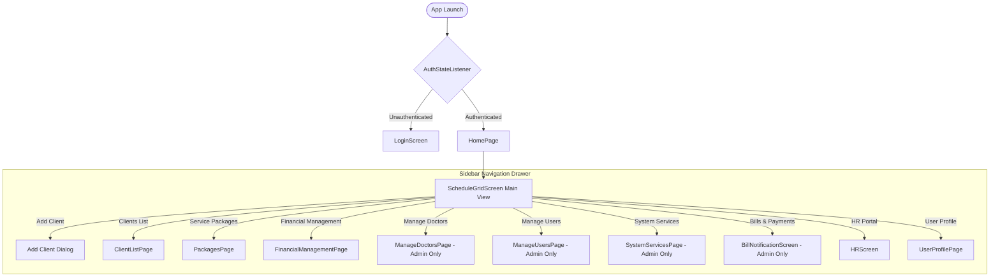

# Navigation & Routing Documentation

This document describes the navigation structure, routing patterns, navigation drawer sidebar, and role-based access control (RBAC) rules within **PhysioOne**.

---

## 🗺️ Navigation Architecture

PhysioOne relies primarily on **Declarative State-Driven Navigation** combined with **MaterialPageRoute Push Navigation**.

---

## 🔒 Role-Based Access Control (RBAC) Matrix

The navigation sidebar (`lib/ui/ScheduleGridPade/widget/buildSideBarContent.dart`) conditionally renders menu items based on `user.role` or `user.position`:

| Destination Screen | Target Class | `admin` | `desk` | `doctor` / `staff` |
|---|---|:---:|:---:|:---:|
| **Schedule Grid Matrix** | `ScheduleGridScreen` | ✅ | ✅ | ✅ |
| **Add Client** | `_addClient` (Dialog) | ✅ | ✅ | ❌ |
| **Clients List** | `ClientListPage` | ✅ | ✅ | ❌ |
| **Service Packages** | `PackagesPage` | ✅ | ✅ | ❌ |
| **Financial Management** | `FinancialManagementPage` | ✅ | ✅ | ❌ |
| **Manage Doctors** | `ManageDoctorsPage` | ✅ | ❌ | ❌ |
| **Manage Users** | `ManageUsersPage` | ✅ | ❌ | ❌ |
| **System Services** | `SystemServicesPage` | ✅ | ❌ | ❌ |
| **Bills & Payments** | `BillNotificationScreen` | ✅ | ❌ | ❌ |
| **HR & Attendance** | `HRScreen` | ✅ | ✅ | ✅ |
| **User Profile** | `UserProfilePage` | ✅ | ✅ | ✅ |

---

## 📍 Direct Route Table

| Route Name / Method | Screen Class | Parameters Passed | File Path |
|---|---|---|---|
| Initial Home (`/`) | `AuthStateListener` | None | `lib/main.dart:133` |
| Login Screen | `LoginScreen` | None | `lib/ui/LoginPage/ui/login_page.dart` |
| Main Dashboard | `ScheduleGridScreen` | `UserModel user` | `lib/ui/ScheduleGridPade/ui/schedule_grid_pade.dart` |
| Client List | `ClientListPage` | None | `lib/ui/ClientListPage/ui/client_list_page.dart` |
| Financial Page | `FinancialManagementPage` | None | `lib/ui/FinancialManagementPage/ui/financial_management_page.dart` |
| Manage Doctors | `ManageDoctorsPage` | None | `lib/ui/ManageDoctorPage/ui/manage_doctors_page.dart` |
| Manage Users | `ManageUsersPage` | None | `lib/ui/ManageUserPage/ui/manage_users_page.dart` |
| Packages Page | `PackagesPage` | None | `lib/ui/PackagesPage/ui/packages_page.dart` |
| HR Screen | `HRScreen` | `UserModel currentUser` | `lib/hr_system/ui/hr_screen.dart` |
| System Services | `SystemServicesPage` | None | `lib/ui/billPaymentScreen/ui/system_services_page.dart` |
| Bill Notifications | `BillNotificationScreen` | None | `lib/ui/billPaymentScreen/ui/bill_notification_screen.dart` |
| User Profile | `UserProfilePage` | `UserModel user` | `lib/ui/ScheduleGridPade/ui/user_profile_page.dart` |
